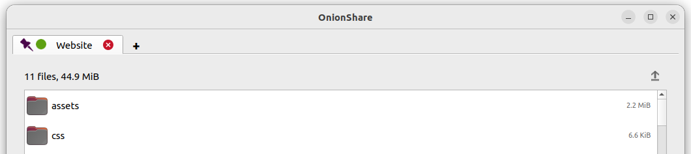
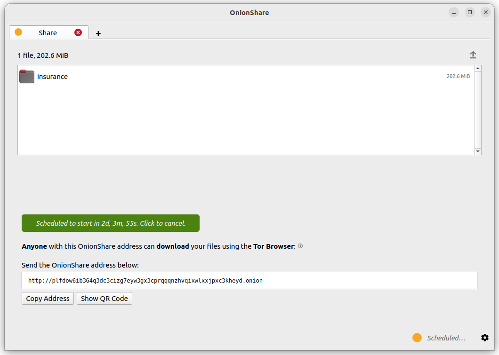

Advanced Usage
==============

.. _save_tabs:

Save Tabs
---------

Everything in OnionShare is temporary by default. If you close an OnionShare tab, its address no longer exists and it can't be used again.
Sometimes you might want an OnionShare service to be persistent.
This is useful if you want to host a website available from the same OnionShare address even if you reboot your computer.

To make any tab persistent, check the "Save this tab, and automatically open it when I open OnionShare" box before starting the server.
When a tab is saved a purple pin icon appears to the left of its server status.

When you quit OnionShare and then open it again, your saved tabs will start opened.
You'll have to manually start each service, but when you do they will start with the same OnionShare address and private key.

If you save a tab, a copy of that tab's onion service secret key will be stored on your computer with your OnionShare settings.

.. _turn_off_private_key:

Turn Off Private Key
--------------------

By default, all OnionShare services are protected with a private key, which Tor calls "client authentication".

When browsing to an OnionShare service in Tor Browser, Tor Browser will prompt for the private key to be entered.

Sometimes you might want your OnionShare service to be accessible to the public, like if you want to set up an OnionShare receive service so the public can securely and anonymously send you files.
In this case, it's better to disable the private key altogether.

To turn off the private key for any tab, check the "This is a public OnionShare service (disables private key)" box before starting the server. Then the server will be public and won't need a private key to view in Tor Browser.

.. _custom_titles:

Custom Titles
-------------

By default, when people load an OnionShare service in Tor Browser they see the default title for the type of service. For example, the default title of a chat service is "OnionShare Chat".

If you want to choose a custom title, set the "Custom title" setting before starting a server.

Scheduled Times
---------------

OnionShare supports scheduling exactly when a service should start and stop.
Before starting a server, click "Show advanced settings" in its tab and then check the boxes next to either "Start onion service at scheduled time", "Stop onion service at scheduled time", or both, and set the respective desired dates and times.

If you scheduled a service to start in the future, when you click the "Start sharing" button you will see a timer counting down until it starts.
If you scheduled it to stop in the future, after it's started you will see a timer counting down to when it will stop automatically.

**Scheduling an OnionShare service to automatically start can be used as a dead man's switch**, where your service will be made public at a given time in the future if anything happens to you.
If nothing happens to you, you can cancel the service before it's scheduled to start.

**Scheduling an OnionShare service to automatically stop can be useful to limit exposure**, like if you want to share secret documents while making sure they're not available on the internet for more than a few days.

.. image:: _static/screenshots/advanced-schedule-stop-timer.png

.. _cli:

Command-line Interface
----------------------

In addition to its graphical interface, OnionShare has a command-line interface.

You can install just the command-line version of OnionShare using ``pip3``::

    pip3 install --user onionshare-cli

Note that you will also need the ``tor`` package installed. In macOS, install it with: ``brew install tor``

Then run it like this::

    onionshare-cli --help

For information about installing it on different operating systems, see the `CLI readme file <https://github.com/onionshare/onionshare/blob/develop/cli/README.md>`_ in the git repository.

If you installed OnionShare using the Linux Snapcraft package, you can also just run ``onionshare.cli`` to access the command-line interface version.

Usage
^^^^^

You can browse the command-line documentation by running ``onionshare --help``::

    $ onionshare-cli --help
    ╭───────────────────────────────────────────╮
    │    *            ▄▄█████▄▄            *    │
    │               ▄████▀▀▀████▄     *         │
    │              ▀▀█▀       ▀██▄              │
    │      *      ▄█▄          ▀██▄             │
    │           ▄█████▄         ███        -+-  │
    │             ███         ▀█████▀           │
    │             ▀██▄          ▀█▀             │
    │         *    ▀██▄       ▄█▄▄     *        │
    │ *             ▀████▄▄▄████▀               │
    │                 ▀▀█████▀▀                 │
    │             -+-                     *     │
    │   ▄▀▄               ▄▀▀ █                 │
    │   █ █     ▀         ▀▄  █                 │
    │   █ █ █▀▄ █ ▄▀▄ █▀▄  ▀▄ █▀▄ ▄▀▄ █▄▀ ▄█▄   │
    │   ▀▄▀ █ █ █ ▀▄▀ █ █ ▄▄▀ █ █ ▀▄█ █   ▀▄▄   │
    │                                           │
    │                  v2.4.1                   │
    │                                           │
    │          https://onionshare.org/          │
    ╰───────────────────────────────────────────╯

    usage: onionshare-cli [-h] [--receive] [--website] [--chat] [--local-only] [--connect-timeout SECONDS] [--config FILENAME] [--persistent FILENAME] [--title TITLE] [--public]
                          [--auto-start-timer SECONDS] [--auto-stop-timer SECONDS] [--no-autostop-sharing] [--data-dir data_dir] [--webhook-url webhook_url] [--disable-text]
                          [--disable-files] [--disable_csp] [--custom_csp custom_csp] [-v]
                          [filename ...]

    positional arguments:
      filename                  List of files or folders to share

    optional arguments:
      -h, --help                show this help message and exit
      --receive                 Receive files
      --website                 Publish website
      --chat                    Start chat server
      --local-only              Don't use Tor (only for development)
      --connect-timeout SECONDS
                                Give up connecting to Tor after a given amount of seconds (default: 120)
      --config FILENAME         Filename of custom global settings
      --persistent FILENAME     Filename of persistent session
      --title TITLE             Set a title
      --public                  Don't use a private key
      --auto-start-timer SECONDS
                                Start onion service at scheduled time (N seconds from now)
      --auto-stop-timer SECONDS
                                Stop onion service at schedule time (N seconds from now)
      --no-autostop-sharing     Share files: Continue sharing after files have been sent (default is to stop sharing)
      --data-dir data_dir       Receive files: Save files received to this directory
      --webhook-url webhook_url
                                Receive files: URL to receive webhook notifications
      --disable-text            Receive files: Disable receiving text messages
      --disable-files           Receive files: Disable receiving files
      --disable_csp             Publish website: Disable the default Content Security Policy header (allows your website to use third-party resources)
      --custom_csp custom_csp   Publish website: Set a custom Content Security Policy header
      -v, --verbose             Log OnionShare errors to stdout, and web errors to disk
