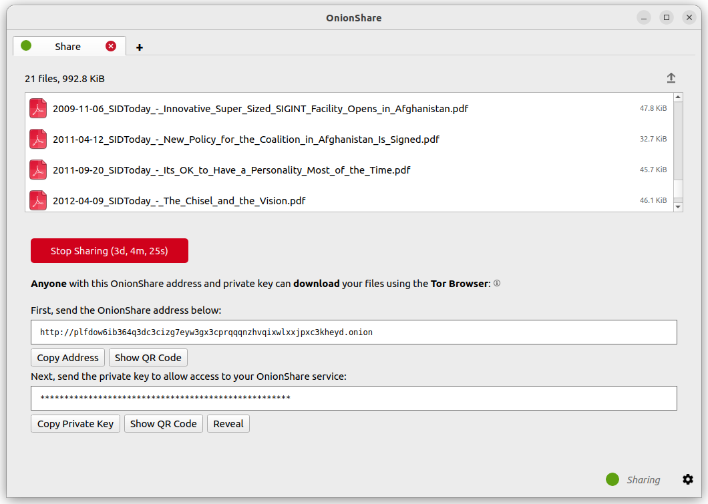

Advanced Usage
==============

.. _save_tabs:

Save Tabs
---------

Closing OnionShare tabs you host destroys them, preventing reuse.
Persistently hosted websites are available on the same address even if the computer they are shared from is rebooted.

Make any tab persistent by checking the "Always open this tab when OnionShare is started" box before starting your server.

.. image:: _static/screenshots/advanced-save-tabs.png

When opening OnionShare, your saved tabs from the prior session will start opened.
Each service then can be started manually, and will be available on the same OnionShare address and be protected by the same private key.

If you save a tab, a copy of its onion service secret key is stored on your computer.

.. _turn_off_private_key:

Turn Off Private Key
--------------------

By default, all OnionShare services are protected with a private key, which Tor calls "client authentication".

The Tor Browser will ask you to enter your private key when you load an OnionShare service.
If you want allow the public to use your service, it's better to disable the private key altogether.

To turn off the private key for any tab, check the "This is a public OnionShare service (disables private key)" box before starting the server.
Then the server will be public and a private key is not needed to load it in the Tor Browser.

.. _custom_titles:

Custom Titles
-------------

When people load OnionShare services in the Tor Browser they see the default title for each type of service.
For example, the default title for chat services is "OnionShare Chat".

If you edit the "Custom title" setting before starting a server you can change it.

Scheduled Times
---------------

OnionShare supports scheduling exactly when a service should start and stop.
Before starting a server, click "Show advanced settings" in its tab and then check the boxes next to either
"Start onion service at scheduled time", "Stop onion service at scheduled time", or both, and set the respective desired dates and times.

Services scheduled to start in the future display a countdown timer when when the "Start sharing" button is clicked.
Services scheduled to stop in the future display a countdown timer when started.

**Scheduling an OnionShare service to automatically start can be used as a dead man's switch**.
This means your service is made public at a given time in the future if you are not there to prevent it.
If nothing happens to you, you can cancel the service before it's scheduled to start.

.. image:: _static/screenshots/advanced-schedule-start-timer.png

**Scheduling an OnionShare service to automatically stop limits its exposure**.
If you want to share secret info or something that will be outdated, you can do so for selected limited time.

.. _cli:

Command-line Interface
----------------------

In addition to its graphical interface, OnionShare has a command-line interface.

You can install just the command-line version of OnionShare using ``pip3``::

    pip3 install --user onionshare-cli

Note that you will also need the ``tor`` package installed. In macOS, install it with: ``brew install tor``

Then run it like this::

    onionshare-cli --help

Info about installing it on different operating systems can be found in the `CLI README file <https://github.com/onionshare/onionshare/blob/develop/cli/README.md>`_ in the Git repository.

If you installed OnionShare using the Snap package, you can also just run ``onionshare.cli`` to access the command-line interface version.

Usage
^^^^^

Browse the command-line documentation by running ``onionshare --help``::

    $ onionshare-cli --help
    ╭───────────────────────────────────────────╮
    │    *            ▄▄█████▄▄            *    │
    │               ▄████▀▀▀████▄     *         │
    │              ▀▀█▀       ▀██▄              │
    │      *      ▄█▄          ▀██▄             │
    │           ▄█████▄         ███        -+-  │
    │             ███         ▀█████▀           │
    │             ▀██▄          ▀█▀             │
    │         *    ▀██▄       ▄█▄▄     *        │
    │ *             ▀████▄▄▄████▀               │
    │                 ▀▀█████▀▀                 │
    │             -+-                     *     │
    │   ▄▀▄               ▄▀▀ █                 │
    │   █ █     ▀         ▀▄  █                 │
    │   █ █ █▀▄ █ ▄▀▄ █▀▄  ▀▄ █▀▄ ▄▀▄ █▄▀ ▄█▄   │
    │   ▀▄▀ █ █ █ ▀▄▀ █ █ ▄▄▀ █ █ ▀▄█ █   ▀▄▄   │
    │                                           │
    │                  v2.4.1                   │
    │                                           │
    │          https://onionshare.org/          │
    ╰───────────────────────────────────────────╯

    usage: onionshare-cli [-h] [--receive] [--website] [--chat] [--local-only] [--connect-timeout SECONDS] [--config FILENAME] [--persistent FILENAME] [--title TITLE] [--public]
                          [--auto-start-timer SECONDS] [--auto-stop-timer SECONDS] [--no-autostop-sharing] [--data-dir data_dir] [--webhook-url webhook_url] [--disable-text]
                          [--disable-files] [--disable_csp] [--custom_csp custom_csp] [-v]
                          [filename ...]

    positional arguments:
      filename                  List of files or folders to share

    optional arguments:
      -h, --help                Show this help message and exit
      --receive                 Receive files
      --website                 Publish website
      --chat                    Start chat server
      --local-only              Don't use Tor (only for development)
      --connect-timeout SECONDS
                                Give up connecting to Tor after a given amount of seconds (default: 120)
      --config FILENAME         Filename of custom global settings
      --persistent FILENAME     Filename of persistent session
      --title TITLE             Set a title
      --public                  Don't use a private key
      --auto-start-timer SECONDS
                                Start onion service at scheduled time (N seconds from now)
      --auto-stop-timer SECONDS
                                Stop onion service at scheduled time (N seconds from now)
      --no-autostop-sharing     Share files: Continue sharing after files have been sent (the default is to stop sharing)
      --data-dir data_dir       Receive files: Save files received to this directory
      --webhook-url webhook_url
                                Receive files: URL to receive webhook notifications
      --disable-text            Receive files: Disable receiving text messages
      --disable-files           Receive files: Disable receiving files
      --disable_csp             Publish website: Disable the default Content Security Policy header (allows your website to use third-party resources)
      --custom_csp custom_csp   Publish website: Set a custom Content Security Policy header
      -v, --verbose             Log OnionShare errors to stdout, and web errors to disk

Keyboard Shortcuts
------------------

The OnionShare desktop application contains some keyboard shortcuts, for convenience and accessibility::

    Ctrl T - New Tab
    Ctrl X - Closes current tab

And from the main mode chooser screen::

    Ctrl S - Share mode
    Ctrl R - Receive mode
    Ctrl W - Website mode
    Ctrl C - Chat mode
    Ctrl H - Settings tab
