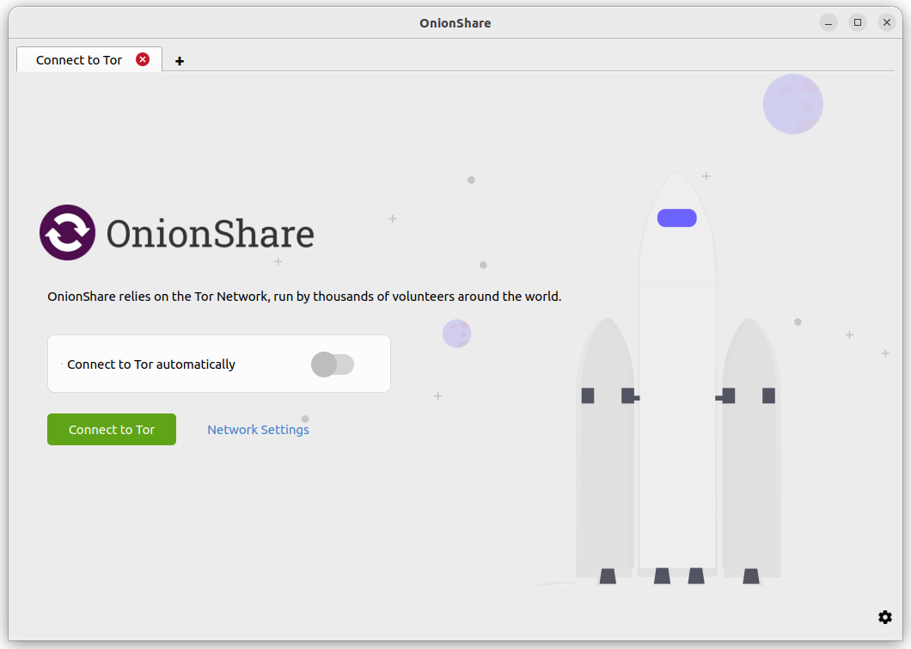
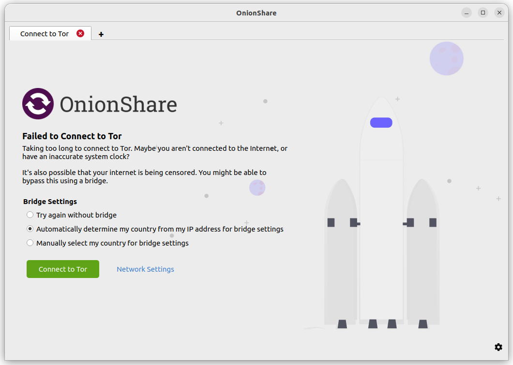
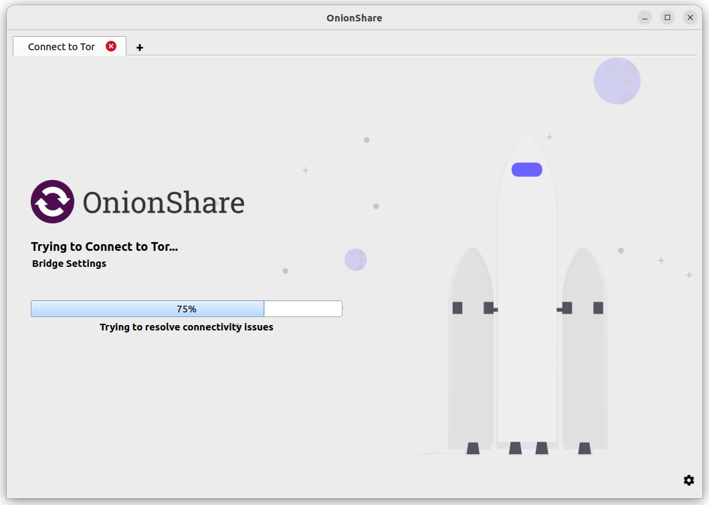

Getting connected to Tor
========================

When OnionShare starts, it will present a screen asking you to connect to the Tor network.

You have several choices. You can click "Connect to Tor" to begin the connection process. If there are no problems with your network, including any attempts to block your access to the Tor network, this should hopefully work the first time.

If you want to manually configure Bridges or other Tor settings before you connect, you can click "Network Settings".

Automatic censorship circumvention
----------------------------------

When OnionShare fails to connect to Tor, it might be because Tor is censored in your country, or on your local network.

If this occurs, a screen will be displayed that will offer you to either "Use a Bridge" (automatically choosing one for you), or "Try Again without a Bridge".

What 'Use a Bridge' does
^^^^^^^^^^^^^^^^^^^^^^^^

Bridges are a way to connect to the Tor network via intermediate services that are hopefully not blocked by your network provider (whereas normal connections might be).

Clicking 'Use a Bridge' will temporarily use the `Meek <https://gitlab.torproject.org/legacy/trac/-/wikis/doc/meek/>`_ domain-fronting proxy to make a non-Tor connection from your computer to the Tor Project's Censorship Circumvention API. The use of the Meek proxy is to hide the fact that you are trying to find a way to connect to Tor.

Before clicking 'Use a Bridge', you can choose either 'Automatically determine my country from my IP address' or 'Manually select my country'.

If you choose the former option, the Censorship Circumvention API will consider your IP address (yes, your real IP address) to determine what country you might reside in.

Based on the country information, the API will try to automatically find bridges that suit your location.

If you choose to manually select a country, OnionShare will still make a request to the Censorship Circumvention API, but will tell the API the country code. The API will then try to fetch bridges for that country that you specified.

If it finds any such bridges, OnionShare will try to reconnect to Tor using those bridges.

If the API does not find any bridges for your location, OnionShare will ask the API for 'fallback' options. At the time of writing, this is likely to be the obfs4 built-in bridges.

OnionShare will also attempt to use the obfs4 built-in bridges if for some reason it could not connect to the API itself, or the API returned an error.

It's important to note that the requests to the Censorship Circumvention API do not go over the Tor Network (because if you could connect to Tor already, you wouldn't need to connect to the API).

Even though it is hard for an adversary to discover where the Meek request is going, this may still be risky for some users. Therefore, it is an opt-in feature. The use of Meek and non-torified network requests are limited only to making one or two requests to the Censorship Circumvention API. Then Meek is stopped, and all further network requests happen over the Tor network.

If you are uncomfortable with making a request that doesn't go over the Tor network, you can click the Network Settings (or the Settings icon in the bottom right corner, followed by the Tor Settings tab in the screen that appears), and manually configure bridges. After you save any bridge settings, OnionShare will try to reconnect using those bridges.

What 'Try again without a Bridge' does
^^^^^^^^^^^^^^^^^^^^^^^^^^^^^^^^^^^^^^

Clicking 'Try again without a Bridge' will retry the normal OnionShare connection attempt to Tor. It won't talk to the Tor Censorship Circumvention API or use Meek.

Connect to Tor automatically
----------------------------

You can toggle on the switch 'Connect to Tor automatically' before clicking 'Connect to Tor'. This means that next time OnionShare starts, it will automatically connect with its Tor connection settings from the last session, instead of presenting you with the connection options.

If the connection fails, you can still try bridges or reconfigure Tor via the 'Network Settings'.

