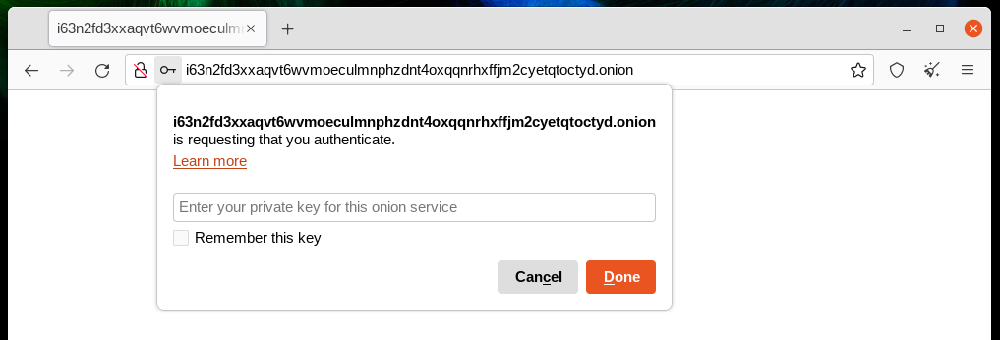
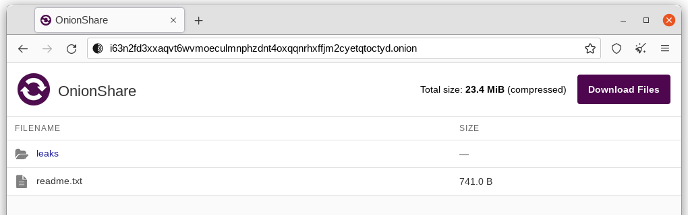
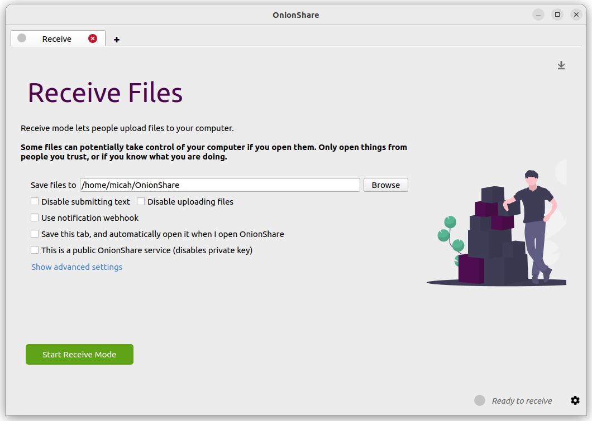
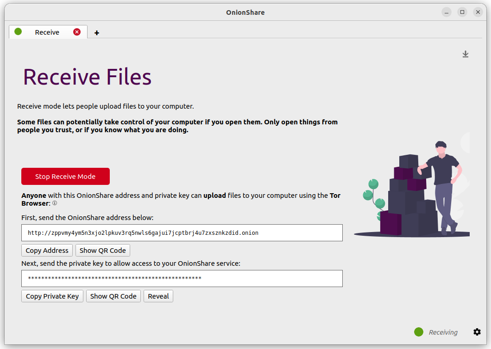
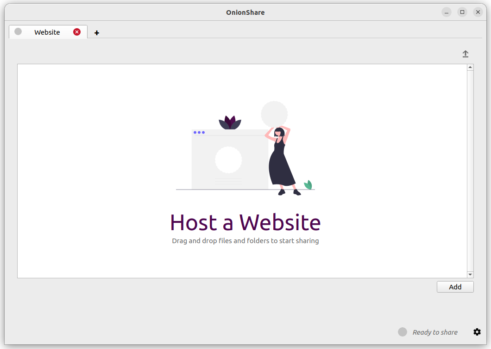
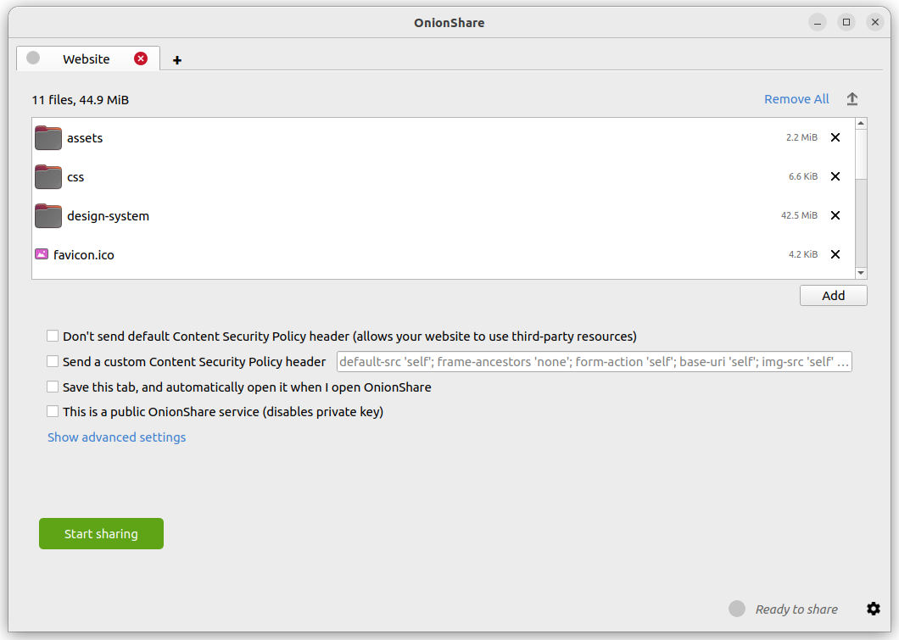
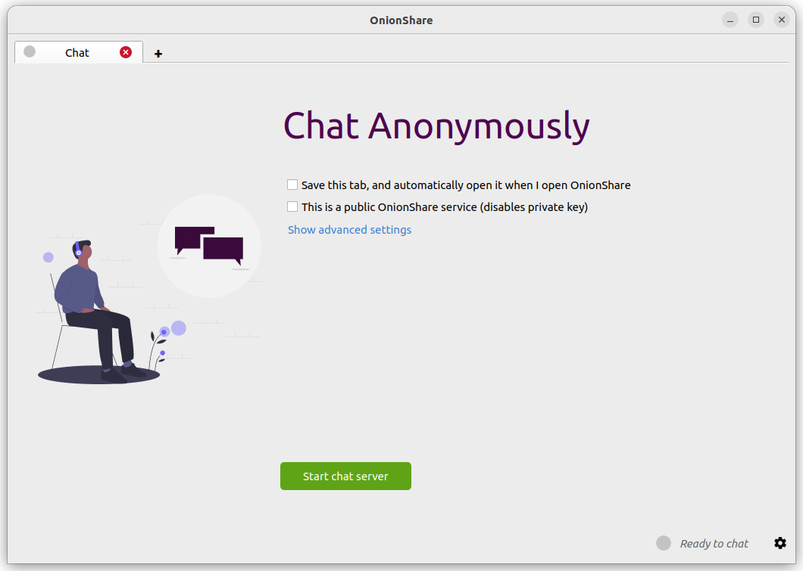
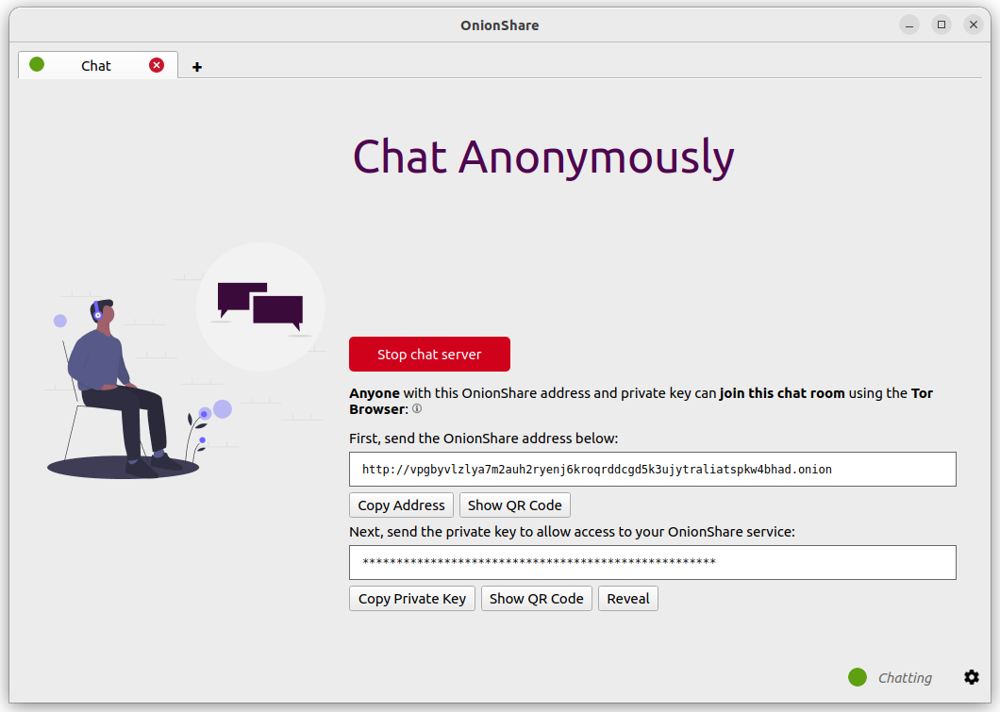
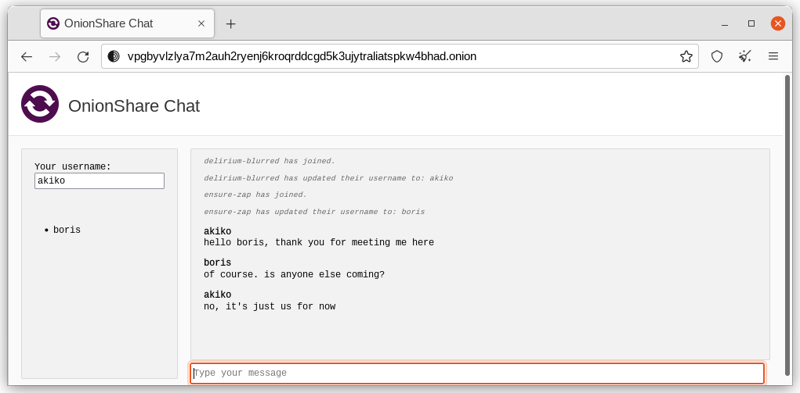

.. _how_it_works:

How OnionShare Works
====================

Web servers are started locally on your computer and made accessible to other people as `Tor <https://www.torproject.org/>`_ `onion services <https://community.torproject.org/onion-services/>`_.

By default, OnionShare web addresses are protected with a private key.

OnionShare addresses look something like this::

    http://oy5oaslxxzwib7fsjaiz5mjeyg3ziwdmiyeotpjw6etxi722pn7pqsyd.onion

And private keys might look something like this::

    K3N3N3U3BURJW46HZEZV2LZHBPKEFAGVN6DPC7TY6FHWXT7RLRAQ

You're responsible for securely sharing that URL and private key using a communication channel of your choice like in an encrypted chat message, or using something less secure like unencrypted email, depending on your `threat model <https://ssd.eff.org/module/your-security-plan>`_.

The people you send the URL to then copy and paste it into their `Tor Browser <https://www.torproject.org/>`_ to access the OnionShare service. Tor Browser will then prompt for the private key, which the people can also then copy and paste in.

If you run OnionShare on your laptop to send someone files, and then suspend it before the files are sent, the service will not be available until your laptop is unsuspended and on the internet again. OnionShare works best when working with people in real-time.

Because your own computer is the web server, *no third party can access anything that happens in OnionShare*, not even the developers of OnionShare. It's completely private. And because OnionShare is based on Tor onion services too, it also protects your anonymity. See the :doc:`security design </security>` for more info.

Share Files
-----------

You can use OnionShare to send files and folders to people securely and anonymously. Open a share tab, drag in the files and folders you wish to share, and click "Start sharing".

.. image:: _static/screenshots/share.png

After you add files, you'll see some settings. Make sure you choose the setting you're interested in before you start sharing.

.. image:: _static/screenshots/share-files.png

As soon as someone finishes downloading your files, OnionShare will automatically stop the server, removing the website from the internet.
To allow multiple people to download them, uncheck the "Stop sharing after files have been sent (uncheck to allow downloading individual files)" box.

Also, if you uncheck this box, people will be able to download the individual files you share rather than a single compressed version of all the files.

When you're ready to share, click the "Start sharing" button. You can always click "Stop sharing", or quit OnionShare, immediately taking the website down. You can also click the "↑" icon in the top-right corner to show the history and progress of people downloading files from you.

.. image:: _static/screenshots/share-sharing.png

Now that you have a OnionShare, copy the address and the private key and send it to the person you want to receive the files. If the files need to stay secure, or the person is otherwise exposed to danger, use an encrypted messaging app.

That person then must load the address in Tor Browser. After logging in with the private key, the files can be downloaded directly from your computer by clicking the "Download Files" link in the corner.

Receive Files and Messages
--------------------------

You can use OnionShare to let people anonymously submit files and messages directly to your computer, essentially turning it into an anonymous dropbox.
Open a receive tab and choose the settings that you want.

You can browse for a folder to save messages and files that get submitted.

You can check "Disable submitting text" if want to only allow file uploads, and you can check "Disable uploading files" if you want to only allow submitting text messages, like for an anonymous contact form.

You can check "Use notification webhook" and then choose a webhook URL if you want to be notified when someone submits files or messages to your OnionShare service.
If you use this feature, OnionShare will make an HTTP POST request to this URL whenever someone submits files or messages.
For example, if you want to get an encrypted text messaging on the messaging app `Keybase <https://keybase.io/>`_, you can start a conversation with `@webhookbot <https://keybase.io/webhookbot>`_, type ``!webhook create onionshare-alerts``, and it will respond with a URL. Use that as the notification webhook URL.
If someone uploads a file to your receive mode service, @webhookbot will send you a message on Keybase letting you know as soon as it happens.

When you are ready, click "Start Receive Mode". This starts the OnionShare service. Anyone loading this address in their Tor Browser will be able to submit files and messages which get uploaded to your computer.

You can also click the down "↓" icon in the top-right corner to show the history and progress of people sending files to you.

Here is what it looks like for someone sending you files and messages.

.. image:: _static/screenshots/receive-torbrowser.png

When someone submits files or messages to your receive service, by default they get saved to a folder called ``OnionShare`` in the home folder on your computer, automatically organized into separate subfolders based on the time that the files get uploaded.

Setting up an OnionShare receiving service is useful for journalists and others needing to securely accept documents from anonymous sources. When used in this way, OnionShare is sort of like a lightweight, simpler, not quite as secure version of `SecureDrop <https://securedrop.org/>`_, the whistleblower submission system.

Use at your own risk
^^^^^^^^^^^^^^^^^^^^

Just like with malicious email attachments, it's possible someone could try to attack your computer by uploading a malicious file to your OnionShare service. OnionShare does not add any safety mechanisms to protect your system from malicious files.

If you receive an Office document or a PDF through OnionShare, you can convert these documents into PDFs that are safe to open using `Dangerzone <https://dangerzone.rocks/>`_. You can also protect yourself when opening untrusted documents by opening them in `Tails <https://tails.boum.org/>`_ or in a `Qubes <https://qubes-os.org/>`_ disposableVM.

However, it is always safe to open text messages sent through OnionShare.

Tips for running a receive service
^^^^^^^^^^^^^^^^^^^^^^^^^^^^^^^^^^

If you want to host your own anonymous dropbox using OnionShare, it's recommended you do so on a separate, dedicated computer always powered on and connected to the internet, and not on the one you use on a regular basis.

If you intend to put the OnionShare address on your website or social media profiles, save the tab (see :ref:`save_tabs`) and run it as a public service (see :ref:`turn_off_private_key`). It's also a good idea to give it a custom title (see :ref:`custom_titles`).

Host a Website
--------------

To host a static HTML website with OnionShare, open a website tab, drag the files and folders that make up the static content there, and click "Start sharing" when you are ready.

If you add an ``index.html`` file, it will render when someone loads your website. You should also include any other HTML files, CSS files, JavaScript files, and images that make up the website. (Note that OnionShare only supports hosting *static* websites. It can't host websites that execute code or use databases. So you can't for example use WordPress.)

If you don't have an ``index.html`` file, it will show a directory listing instead, and people loading it can look through the files and download them.

After you add files, you'll see some settings. Make sure you choose the setting you're interested in before you start sharing.

Content Security Policy
^^^^^^^^^^^^^^^^^^^^^^^

By default OnionShare helps secure your website by setting a strict `Content Security Policy <https://en.wikipedia.org/wiki/Content_Security_Policy>`_ header. However, this prevents third-party content from loading inside the web page.

If you want to load content from third-party websites, like assets or JavaScript libraries from CDNs, you have two options:

- You can disable sending a Content Security Policy header by checking the "Don't send Content Security Policy header (allows your website to use third-party resources)" box before starting the service.
- You can send a custom Content Security Policy header.

Tips for running a website service
^^^^^^^^^^^^^^^^^^^^^^^^^^^^^^^^^^

If you want to host a long-term website using OnionShare (meaning not just to quickly show someone something), it's recommended you do it on a separate, dedicated computer that is always powered on and connected to the internet, and not on the one you use on a regular basis.
Save the tab (see :ref:`save_tabs`) so you can resume the website with the same address if you close OnionShare and re-open it later.

If your website is intended for the public, you should run it as a public service (see :ref:`turn_off_private_key`).

Chat Anonymously
----------------

You can use OnionShare to set up a private, secure chat room that doesn't log anything. Just open a chat tab and click "Start chat server".

After you start the server, copy the OnionShare address and private key and send them to the people you want in the anonymous chat room.
If it's important to limit exactly who can join, use an encrypted messaging app to send out the OnionShare address and private key.

People can join the chat room by loading its OnionShare address in Tor Browser.
The chat room requires JavasScript, so everyone who wants to participate must have their Tor Browser security level set to "Standard" or "Safer", instead of "Safest".

When someone joins the chat room they get assigned a random name.
They can change their name by typing a new name in the box in the left panel and pressing ↵.
Since the chat history isn't saved anywhere, it doesn't get displayed at all, even if others were already chatting in the room.

In an OnionShare chat room, everyone is anonymous.
Anyone can change their name to anything, and there is no way to confirm anyone's identity.

However, if you create an OnionShare chat room and securely send the address only to a small group of trusted friends using encrypted messages, you can be reasonably confident the people joining the chat room are your friends.

How is this useful?
^^^^^^^^^^^^^^^^^^^

If you need to already be using an encrypted messaging app, what's the point of an OnionShare chat room to begin with? It leaves less traces.

If you for example send a message to a Signal group, a copy of your message ends up on each device (the smartphones, and computers if they set up Signal Desktop) of each member of the group. Even if disappearing messages is turned on, it's hard to confirm all copies of the messages are actually deleted from all devices, and from any other places (like notifications databases) they may have been saved to.
OnionShare chat rooms don't store any messages anywhere, so the problem is reduced to a minimum.

OnionShare chat rooms can also be useful for people wanting to chat anonymously and securely with someone without needing to create any accounts.
For example, a source can send an OnionShare address to a journalist using a disposable email address, and then wait for the journalist to join the chat room, all without compromosing their anonymity.

How does the encryption work?
^^^^^^^^^^^^^^^^^^^^^^^^^^^^^

Because OnionShare relies on Tor onion services, connections between the Tor Browser and OnionShare are all end-to-end encrypted (E2EE). When someone posts a message to an OnionShare chat room, they send it to the server through the E2EE onion connection, which then sends it to all other members of the chat room using WebSockets, through their E2EE onion connections.

OnionShare doesn't implement any chat encryption on its own. It relies on the Tor onion service's encryption instead.
