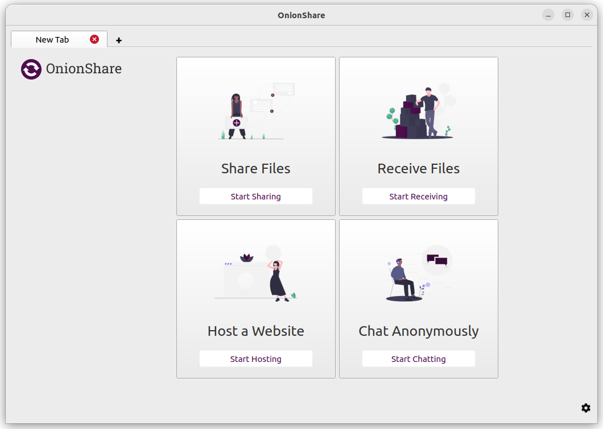

OnionShare's documentation
==========================

.. sidebar:: Language
    
    - `العربية <../ar/>`_
    - `Català <../ca/>`_
    - `正體中文 (繁體) <../zh_Hant/>`_
    - `中文 (简体) <../zh_Hans/>`_
    - `Dansk <../da/>`_
    - `Nederlands <../nl/>`_
    - `English <../en/>`_
    - `Français <../fr/>`_
    - `Deutsch <../de/>`_
    - `Ελληνικά <../el/>`_
    - `Íslenska <../is/>`_
    - `Gaeilge <../ga/>`_
    - `Italiano <../it/>`_
    - `日本語 <../ja/>`_
    - `Norsk Bokmål <../nb/>`_
    - `ﻑﺍﺮﺴﯾ <../fa/>`_
    - `Polski <../pl/>`_
    - `Português (Brasil) <../pt_BR/>`_
    - `Português (Portugal) <../pt_PT/>`_
    - `Română <../ro/>`_
    - `Русский <../ru/>`_
    - `Srpska (latinica) <../sr_Latn/>`_
    - `Español <../es/>`_
    - `Svenska <../sv/>`_
    - `తెలుగు <../te/>`_
    - `Türkçe <../tr/>`_
    - `Українська <../uk/>`_

OnionShare is an open source tool that lets you securely and anonymously share files, host websites, and chat with friends using the Tor network.

.. toctree::
   :maxdepth: 2

   install
   features
   advanced
   tor
   help
   security
   develop
