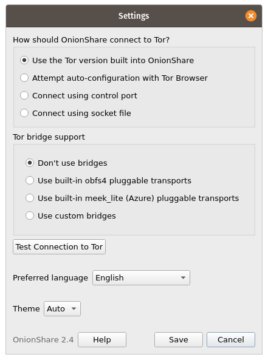

Connecting to Tor
=================

There are several options for how OnionShare should connect to Tor. You can change them in Settings, which you can get to by clicking the gear icon in the bottom-right of the window.

Use Tor that is bundled with OnionShare
---------------------------------------

This is the default way that OnionShare connects to Tor, and it's also the simplest and most reliable way. For this reason, it's recommended for most users.

When you open OnionShare, it will launch a Tor process in the background that's configured specifically for OnionShare to use. This Tor process won't interfere with other Tor processes on your computer, so you're free to run Tor Browser or use a system Tor in the background.

Attempt automatic configuration with Tor Browser
------------------------------------------------

You can configure OnionShare to connect to the Tor that comes with Tor Browser. First, `download Tor Browser <https://www.torproject.org>`_ here if you don't already have it. With this setting selected, you need to keep Tor Browser open in the background while you're using OnionShare.

Using a system Tor in Windows
-----------------------------

This is fairly advanced. You'll need to know how edit plaintext files and do stuff as an administrator.

Download the Tor Windows Expert Bundle, which you can get `from here <https://www.torproject.org/download/tor/>`_. Extract the zip file and copy the extracted folder to ``C:\Program Files (x86)\``, and rename the folder to ``tor-win32``, so that inside that folder is the ``Data`` and ``Tor`` folders.

Make up a control port password. I'm going to use ``comprised stumble rummage work avenging construct volatile`` as my password. Now open a command prompt as an administrator, and use ``tor.exe --hash-password`` to generate a hash of your password. For example::

    cd "C:\Program Files (x86)\tor-win32\Tor"
    tor.exe --hash-password "comprised stumble rummage work avenging construct volatile"

The hashed password output is displayed after some warnings (which you can ignore). In my case, it was ``16:00322E903D96DE986058BB9ABDA91E010D7A863768635AC38E213FDBEF``.

Now create a new text file at ``C:\Program Files (x86)\tor-win32\torrc`` and put this in it, replacing the ``HashedControlPassword`` with the one you just generated::

    ControlPort 9051
    HashedControlPassword 16:00322E903D96DE986058BB9ABDA91E010D7A863768635AC38E213FDBEF

In your administrator command prompt, install tor as a service using the appropriate ``torrc`` file you just created (see `here <https://2019.www.torproject.org/docs/faq.html.en#NTService>`_ for more information on doing this). Like this::

    tor.exe --service install -options -f "C:\Program Files (x86)\tor-win32\torrc"

You're now running a system Tor in Windows!

Open OnionShare. Click the Settings icon. Under "How should OnionShare connect to Tor?" choose "Connect using control port", and set the control port host to ``127.0.0.1`` and the port to ``9051``. Under "Tor authentication options" choose "Password" and set the password to your password, in my case ``comprised stumble rummage work avenging construct volatile``. Click the "Test Settings" button. If all goes well, you should see successfully connected to tor.

Using a system Tor in macOS
---------------------------

First, install `Homebrew <http://brew.sh/>`_ if you don't already have it. Then, install Tor::

    brew install tor

Now configure Tor to allow connections from OnionShare::

    mkdir -p /usr/local/var/run/tor
    chmod 700 /usr/local/var/run/tor
    echo 'SOCKSPort 9050' >> /usr/local/etc/tor/torrc
    echo 'ControlPort unix:"/usr/local/var/run/tor/control.socket"' >> /usr/local/etc/tor/torrc

And start the system Tor service::

    brew services start tor

Open OnionShare. Click the Settings icon. Under "How should OnionShare connect to Tor?" choose "Connect using socket file", and set the socket file to be ``/usr/local/var/run/tor/control.socket``. Under "Tor authentication options" choose "No authentication, or cookie authentication". Click the "Test Settings" button. If all goes well, you should see successfully connected to tor.

Using a system Tor in Linux
---------------------------

First, install the tor package. If you're using Debian, Ubuntu, or a similar Linux distro, I recommend you use Tor Project's `official repository <https://2019.www.torproject.org/docs/debian.html.en>`_. For example, in Ubuntu 20.04::

    sudo su -c "echo 'deb http://deb.torproject.org/torproject.org focal main' > /etc/apt/sources.list.d/torproject.list"
    curl https://deb.torproject.org/torproject.org/A3C4F0F979CAA22CDBA8F512EE8CBC9E886DDD89.asc | gpg --import
    gpg --export A3C4F0F979CAA22CDBA8F512EE8CBC9E886DDD89 | sudo apt-key add -
    sudo apt-get update
    sudo apt-get install -y tor deb.torproject.org-keyring

Next, add your user to the group that runs the Tor process (in the case of Debian and Ubuntu, ``debian-tor``) and configure OnionShare to connect to your system Tor's control socket file.

Add your user to the ``debian-tor`` group by running this command (replace ``username`` with your actual username)::

    sudo usermod -a -G debian-tor username

Reboot your computer. After it boots up again, open OnionShare. Click the Settings icon. Under "How should OnionShare connect to Tor?" choose "Connect using socket file", and set the socket file to be ``/var/run/tor/control``. Under "Tor authentication options" choose "No authentication, or cookie authentication". Click the "Test Settings" button. If all goes well, you should see successfully connect to Tor.

Using Tor bridges
-----------------

If your access to the internet is censored, you can configure OnionShare to connect to the Tor network using `Tor bridges <https://2019.www.torproject.org/docs/bridges.html.en>`_. If OnionShare successfully connects to Tor, you don't need to use a bridge.

To configure bridges, open OnionShare settings.

You can use the built-in obfs4 pluggable transports, the built-in meek_lite (Azure) pluggable transports, or custom bridges, which you can obtain from Tor's `BridgeDB <https://bridges.torproject.org/>`_. If you need to use a bridge, you should try the built-in obfs4 ones first.
