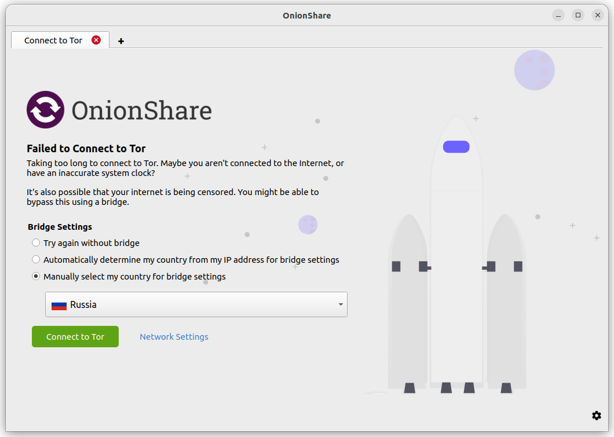
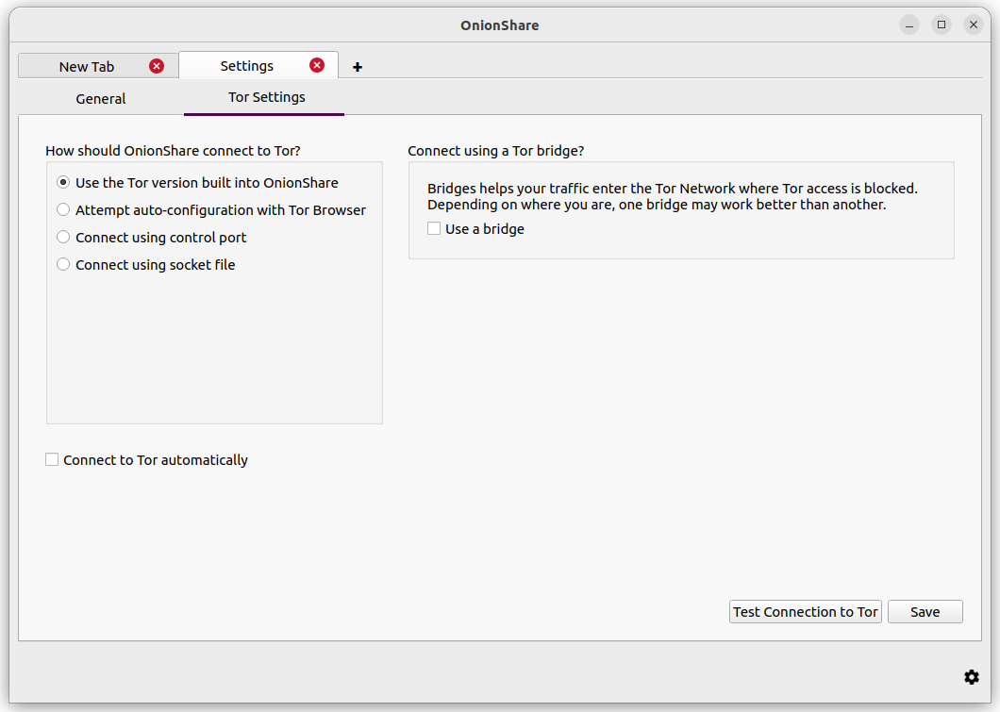
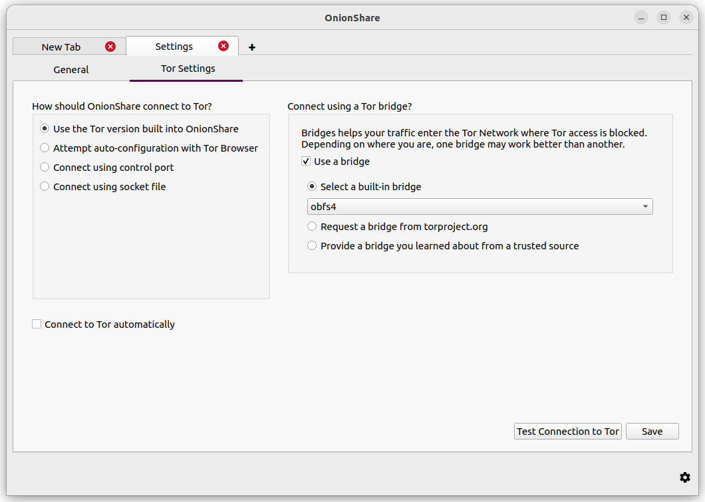
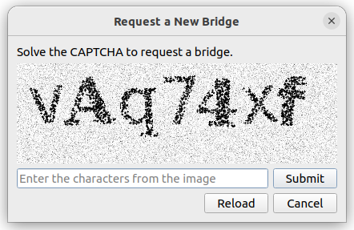

Connecting to Tor
=================

When OnionShare starts, it will show you a screen asking you to connect to the Tor network.

.. image:: _static/screenshots/autoconnect-welcome-screen.png

You can toggle on the switch "Connect to Tor automatically" before clicking "Connect to Tor". This means that next time OnionShare starts, it will automatically connect with its Tor connection settings from the last session, instead of presenting you with the connection options.
If the connection fails, you can still try bridges or reconfigure Tor via the "Network Settings" button.

You can click "Connect to Tor" to begin the connection process. If there are no problems with your network, including any attempts to block your access to the Tor network, this should hopefully work the first time.

Or, if you want to manually configure Bridges or other Tor settings before you connect, you can click "Network Settings".

Automatic censorship circumvention
----------------------------------

When you click "Connect to Tor", if OnionShare fails to connect, it might be because Tor is censored in your country or on your local network.

If this occurs, you will have these choices:

- Try again without a bridge
- Automatically determine my country from my IP address for bridge settings
- Manually select my country for bridge settings

.. image:: _static/screenshots/autoconnect-failed-to-connect.png

If you choose the "Try again without a bridge" option, OnionShare will retry connecting to Tor like normal, without attempting to bypass censorship.

The other two options will attempt to automatically bypass censorship using Tor bridges.
If your network provider is blocking access to the Tor network, you can hopefully still connect to a Tor bridge, which will then connect you to the Tor network, circumventing the censorship.
Both of these options use the Tor Project's Censorship Circumvention API to provide you with bridge settings that should work for you.
OnionShare will temporarily use the `Meek <https://gitlab.torproject.org/legacy/trac/-/wikis/doc/meek/>`_ domain-fronting proxy to make a non-Tor connection from your computer to Tor's Censorship Circumvention API.
The Meek proxy hides the fact that you are trying to find a way to connect to Tor.

If you choose "Automatically determine my country from my IP address for bridge settings", the Censorship Circumvention API will consider your IP address (yes, your real IP address) to determine what country you might reside in.
Based on the country information, the API will try to automatically find bridges that suit your location.

.. image:: _static/screenshots/autoconnect-trying-to-resolve-connectivity-issues.png

If you choose "Manually select my country for bridge settings", the Censorship API will find the bridges that suit the country that you specified.

How automatic censorship circumvention works
^^^^^^^^^^^^^^^^^^^^^^^^^^^^^^^^^^^^^^^^^^^^

If the Censorship Circumvention API finds bridges that it believes will suit you, OnionShare will try to reconnect to Tor using those bridges. If the API does not find any bridges for your location, OnionShare will ask the API for "fallback" options, and then try to reconnect using those.

If for some reason OnionShare fails to connect to the Censorship API itself, or if the API returns an error message, OnionShare will attempt to use the obfs4 built-in bridges.

It's important to note that the requests to the Censorship Circumvention API do not go over the Tor network (because if you could connect to Tor already, you wouldn't need to connect to the API).

Even though it's hard for an adversary to discover where the Meek request is going, this may still be risky for some users. Therefore, it is an opt-in feature. The use of Meek and non-torified network requests are limited only to making one or two requests to the Censorship Circumvention API. Then Meek is stopped, and all further network requests happen over the Tor network.

If you are uncomfortable with making a request that doesn't go over the Tor network, you can click "Network Settings" (or the Settings icon in the bottom right corner, followed by the Tor Settings tab in the screen that appears), and manually configure bridges. After you save any bridge settings, OnionShare will try to reconnect using those bridges.

Manually configure Tor settings
-------------------------------

You can get to the Tor settings by clicking "Network Settings" on the welcome screen, or by clicking the "⚙" icon in the bottom-right corner of the application, and then switch to the Tor Settings tab in the screen that appears.

Here are the different ways you can configure OnionShare to connect to Tor:

Use the Tor version built into OnionShare
^^^^^^^^^^^^^^^^^^^^^^^^^^^^^^^^^^^^^^^^^

This is the default, simplest and most reliable way that OnionShare connects to Tor.
For this reason, it's recommended for most users.

When you open OnionShare, it launches an already configured ``tor`` process in the background for OnionShare to use.
It doesn't interfere with other ``tor`` processes on your computer, so you can use the Tor Browser or the system ``tor`` on their own.

**Using bridges**

To use a bridge, you must select "Use the Tor version built into OnionShare" and check the "Use a bridge" checkbox.

Try using a built-in bridge first. Using `obfs4` or `snowflake` bridges is recommended over using `meek-azure`.

If using a built-in bridge doesn't work, you can request a bridge from torproject.org. You will have to solve a CAPTCHA in order to request a bridge. (This makes it more difficult for governments or ISPs to block access to Tor bridges.)

You also have the option of using a bridge that you learned about from a trusted source.

Attempt auto-configuration with Tor Browser
^^^^^^^^^^^^^^^^^^^^^^^^^^^^^^^^^^^^^^^^^^^

If you have `downloaded the Tor Browser <https://www.torproject.org>`_ and don't want two ``tor`` processes running, you can use the ``tor`` process from the Tor Browser.
Keep in mind you need to keep Tor Browser open in the background while you're using OnionShare for this to work.

Using a system ``tor`` in Windows
^^^^^^^^^^^^^^^^^^^^^^^^^^^^^^^^^

This is fairly advanced. You'll need to know how edit plaintext files and do stuff as an administrator.

Download the Tor Windows Expert Bundle `from <https://www.torproject.org/download/tor/>`_.
Extract the compressed file and copy the extracted folder to ``C:\Program Files (x86)\``
Rename the extracted folder with ``Data`` and ``Tor`` in it to ``tor-win32``.

Make up a control port password.
(Using 7 words in a sequence like ``comprised stumble rummage work avenging construct volatile`` is a good idea for a password.)
Now open a command prompt (``cmd``) as an administrator, and use ``tor.exe --hash-password`` to generate a hash of your password. For example::

    cd "C:\Program Files (x86)\tor-win32\Tor"
    tor.exe --hash-password "comprised stumble rummage work avenging construct volatile"

The hashed password output is displayed after some warnings (which you can ignore). In the case of the above example, it is ``16:00322E903D96DE986058BB9ABDA91E010D7A863768635AC38E213FDBEF``.

Now create a new text file at ``C:\Program Files (x86)\tor-win32\torrc`` and put your hashed password output in it, replacing the ``HashedControlPassword`` with the one you just generated::

    ControlPort 9051
    HashedControlPassword (the hash you generate from the password you picked above)

In your administrator command prompt, install ``tor`` as a service using the appropriate ``torrc`` file you just created (as described in `<https://2019.www.torproject.org/docs/faq.html.en#NTService>`_). Like this::

    tor.exe --service install -options -f "C:\Program Files (x86)\tor-win32\torrc"

You are now running a system ``tor`` process in Windows!

Open OnionShare, click the "⚙" icon in it, and switch to the Tor Settings tab.
Under "How should OnionShare connect to Tor?" choose "Connect using control port", and set
"Control port" to ``127.0.0.1`` and
"Port" to ``9051``.
Under "Tor authentication settings" choose "Password" and set the password to the control port password you picked above.
Click the "Test Connection to Tor" button.
If all goes well, you should see "Connected to the Tor controller".

Using a system ``tor`` in macOS
^^^^^^^^^^^^^^^^^^^^^^^^^^^^^^^

First, install `Homebrew <https://brew.sh/>`_ if you don't already have it, and then install Tor::

    brew install tor

Now configure Tor to allow connections from OnionShare::

    mkdir -p /usr/local/var/run/tor
    chmod 700 /usr/local/var/run/tor
    echo 'SOCKSPort 9050' >> /usr/local/etc/tor/torrc
    echo 'ControlPort unix:"/usr/local/var/run/tor/control.socket"' >> /usr/local/etc/tor/torrc

And start the system Tor service::

    brew services start tor

Open OnionShare, click the "⚙" icon in it, and switch to the Tor Settings tab.
Under "How should OnionShare connect to Tor?" choose "Connect using socket file", and
set the socket file to be ``/usr/local/var/run/tor/control.socket``.
Under "Tor authentication settings" choose "No authentication, or cookie authentication".
Click the "Test Connection to Tor" button.

If all goes well, you should see "Connected to the Tor controller".

Using a system ``tor`` in Linux
^^^^^^^^^^^^^^^^^^^^^^^^^^^^^^^

First, install the ``tor`` package. If you're using Debian, Ubuntu, or a similar Linux distro, It is recommended to use the Tor Project's `official repository <https://support.torproject.org/apt/tor-deb-repo/>`_.

Next, add your user to the group that runs the ``tor`` process (in the case of Debian and Ubuntu, ``debian-tor``) and configure OnionShare to connect to your system ``tor``'s control socket file.

Add your user to the ``debian-tor`` group by running this command (replace ``username`` with your actual username)::

    sudo usermod -a -G debian-tor username

Reboot your computer.
After it boots up again, open OnionShare, click the "⚙" icon in it, and switch to the Tor Settings tab.
Under "How should OnionShare connect to Tor?" choose "Connect using socket file".
Set the socket file to be ``/var/run/tor/control``.
Under "Tor authentication settings" choose "No authentication, or cookie authentication".
Click the "Test Connection to Tor" button.

If all goes well, you should see "Connected to the Tor controller".
